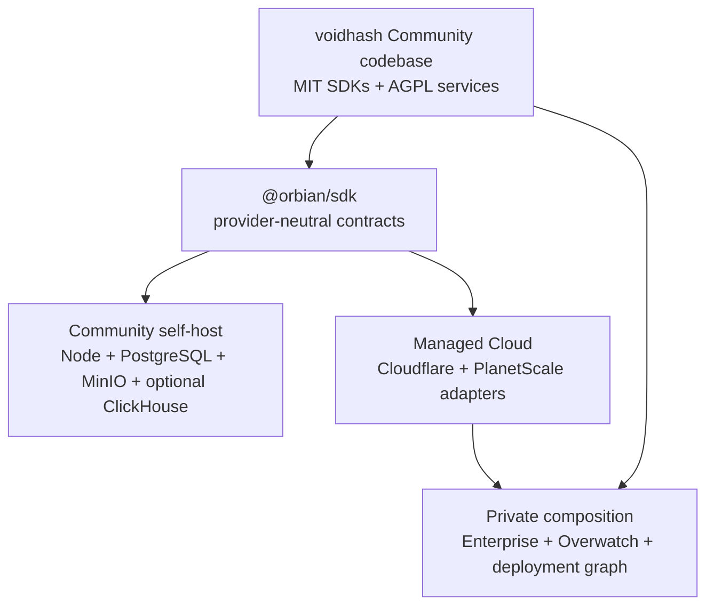

# Voidhash architecture

Voidhash has one canonical Community codebase and two runtime compositions.
This repository contains every MIT and AGPL Community component. The private
cloud repository pins it as a submodule and adds Cloudflare infrastructure,
closed Enterprise packages, the Overwatch operations plane, and cloud-only
integration tests. Community source is never mirrored back into the private
repository.

## Community packages

- `libraries/` contains MIT SDKs embedded in customer applications.
- `apps/backend`, `apps/www`, and `apps/mimic-db` are the AGPL service entry
  points.
- `@orbian/sdk` defines provider-neutral Effect services and application
  primitives for durable objects, queues, workflows, scheduled jobs, key-value
  storage, object storage, screenshots, and mail.
- `packages/core`, `packages/db`, `packages/rpc`, and the remaining service
  packages own portable application and domain behavior.
- `@orbian/node` implements those contracts for a single Node deployment.
  `selfhost/entry` composes the Community application.

Release lockfiles pin `@orbian/sdk` and `@orbian/node` to immutable Orbian
commit artifacts. Contributors working in adjacent checkouts can switch to the
sibling workspace with `pnpm orbian:source workspace`; maintainers prepare a
standalone release with `pnpm orbian:source <full-commit-sha>`.

The publication-boundary check rejects private package scopes, infrastructure
directories, Enterprise code, operations-plane code, and incomplete package
license metadata from this repository.

## Self-host composition

The self-host runtime is a modular monolith. One Node process serves the API
and dashboard and runs Mimic entities, queue consumers, workflows, and cron
fibers. PostgreSQL provides transactional state and durable scheduling; MinIO
provides S3-compatible objects; the compiler is isolated in a private-network
sidecar; Chromium renders paywall artifacts. ClickHouse is an optional
analytics profile. Community v1 uses operator-supplied WorkOS credentials.

See [the self-hosting guide](../selfhost/README.md) for the supported Compose
path and operational requirements.

## Managed cloud composition

The private repository can deploy the same Orbian application primitives to
Cloudflare through `@orbian/alchemy`, and owns deployment state, environments,
secrets, and cloud-only integration tests. Product services continue to import
provider-neutral interfaces; a zero-baseline seam check rejects new Cloudflare
or Alchemy imports from application code.

## Enterprise and operations boundaries

Enterprise packages and Overwatch are private. Enterprise features mount
through explicit Community extension points; the Community application boots
and passes its tests with the private packages absent. Staff authentication,
admin RPC groups, impersonation, support tooling, and license issuance exist
only in the private operations plane.

## Security boundaries

The [backend threat model](security/backend-threat-model.md) covers tenant
isolation, credentials, provider webhooks, storage, analytics, rendering, and
compiler sandboxing. The
[endpoint authorization matrix](security/endpoint-authorization-matrix.md)
records authentication and ownership evidence for the HTTP and RPC surfaces.
