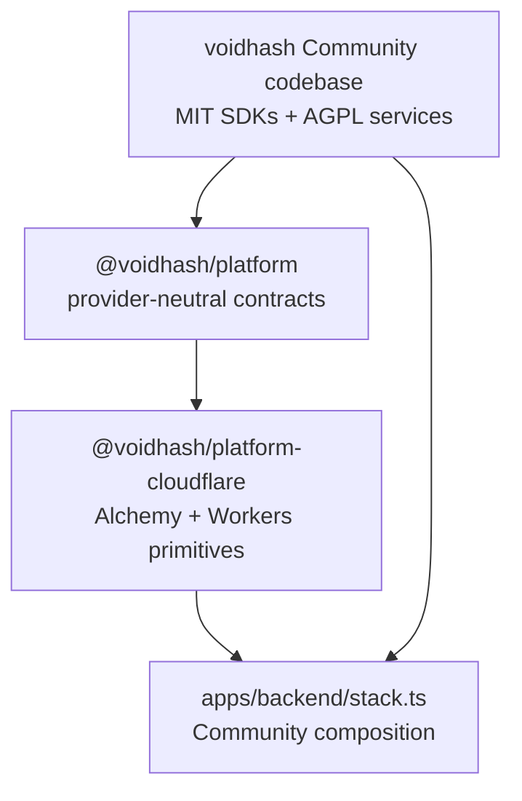

# Voidhash architecture

Voidhash has one canonical Community codebase and one deployment composition.
This repository contains every MIT and AGPL Community component, including the
reusable Alchemy and Cloudflare platform adapters. Application services
depend on provider-neutral contracts and deployment composition stays at the
repository edge.

## Community packages

- `libraries/` contains MIT SDKs embedded in customer applications.
  `libraries/ios` (`@voidhash/ios`) and `libraries/android` (`@voidhash/android`)
  each ship a shared native core — StoreKit/Google Play billing, the paywall
  WebView bridge, the SDK API client, identity, caching, and schema — plus a bare
  native SDK built on top of it. `libraries/react-native` reuses those cores from
  its Nitro adapters instead of owning native purchase logic, so every SDK speaks
  the same wire contracts.
- `apps/backend` and `apps/www` are the AGPL service entry points, and
  `apps/mimic-db` supplies the document-sync engine and reusable Cloudflare
  Worker/Durable Object deployment they compose.
  `packages/backend` is the backend library, while
  `@voidhash/web-app` is the shared web source package they compose.
- `@voidhash/web-app` owns shared web features and separate shared and
  Community route sets. `apps/www` is the thin Community entrypoint that selects
  those routes and supplies standalone auth and edition behavior. Another
  edition can add its own pages and composition modules without mirroring or
  patching Community source.
- `@voidhash/platform` defines provider-neutral Effect services and application
  primitives for durable entities, queues, workflows, scheduled jobs, key-value
  storage, object storage, screenshots, and mail.
- `@voidhash/platform-cloudflare` implements the reusable Cloudflare side of
  those seams with Alchemy-native Workers, Queues, Workflows, Hyperdrive, and
  Durable Object capabilities.
- `packages/core`, `packages/db`, `packages/rpc`, and the remaining service
  packages own portable application and domain behavior.
  Runtime backends are selected per primitive, not per provider, so a deployment
  can move one primitive to a managed service without touching the others. Every
  adapter is validated against the shared conformance suite in
  `@voidhash/platform/conformance`.

The publication-boundary check rejects non-Community package scopes and
incomplete package license metadata from this repository.

## Deployment composition

Cloudflare adapters live in this repository and deploy the same application
primitives through Alchemy. Product services continue to import
provider-neutral interfaces; only composition roots and Cloudflare adapter
modules import Alchemy or Cloudflare APIs.

The Community stack deploys mimic-db alongside the backend, connects the two
Workers with a Cloudflare service binding, and shares the stack's Hyperdrive
connection for durable document storage.

## Repository boundary

Commercial feature implementations and operations tooling are not included in
the Community repository. The Community application boots and passes its tests
using only the packages present here.

## Security boundaries

The [backend threat model](security/backend-threat-model.md) covers tenant
isolation, credentials, provider webhooks, storage, analytics, rendering, and
compiler sandboxing. The
[endpoint authorization matrix](security/endpoint-authorization-matrix.md)
records authentication and ownership evidence for the HTTP and RPC surfaces.
